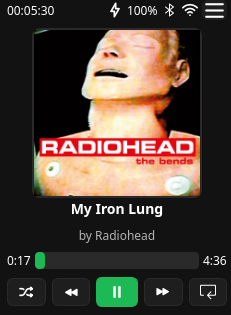
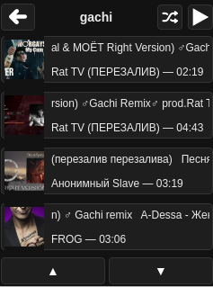

Raspberry Pi Player (C++ / Qt)
==============================

Эта часть проекта отвечает за автономный аудиоплеер, который запускается на устройстве (например, Raspberry Pi) и отображает полноэкранный интерфейс на Qt.

Проект реализован как Qt Widgets‑приложение, использующее сцену (`QGraphicsScene`) с виджетом плеера, а также отдельную сцену для просмотра плейлистов, которые генерирует веб‑часть проекта (Django).


Общая архитектура
-----------------

- **Точка входа**: `res/main.cpp`  
  - Разбирает аргумент командной строки как угол поворота экрана (в градусах), который затем передаётся в графические сцены.  
  - Инициализирует `QApplication`.  
  - Проверяет наличие сети и доступность сайтов (Spotify, YouTube) через `Wifichecker`.  
  - Запускает `xraycontroller` (контроллер внешнего процесса, путь к бинарнику и конфигу задаётся в `xraycontroller.h/.cpp`).  
  - Создаёт и показывает `PlayerScene`.

- **Главная сцена плеера**: `res/ui/PlayerScene.{h,cpp}`  
  - Владеет:
    - `PlayerAudio` — аудио‑движок, обёртка над `QMediaPlayer` и стратегиями разных источников (mp3 / YouTube / Spotify).  
    - `PlayerWindow` — основной UI плеера (обложка, название, артист, время, кнопки play/pause, prev/next, loop, shuffle).  
    - `PlaylistScene` — сцена списка плейлистов и их содержимого.
  - Заворачивает `PlayerWindow` в `QGraphicsScene` и показывает его через `QGraphicsView` во фреймлес‑окне `QMainWindow`.
  - По нажатию кнопки меню (`btnMenu` в `PlayerWindow`) переключает `QGraphicsView` на сцену `PlaylistScene`, а по запросу назад из `PlaylistScene` возвращается на основную сцену.

- **Окно плеера**: `res/ui/PlayerWindow.{h,cpp}`  
  - Управляет:
    - Кнопками управления воспроизведением (`btnPlay`, `btnPrev`, `btnNext`, `btnLoop`, `btnShuffle`).  
    - Прогресс‑баром и метками текущего/общего времени.  
    - Текущей обложкой трека (`lblCover`).  
    - Бегущими строками для названия и артиста (`MarqueeController`).  
  - Реагирует на события `QMediaPlayer` (смена статуса, позиция, длительность, метаданные) и обновляет UI.  
  - Обрабатывает горячие клавиши (Esc, Space, стрелки, F7) через `keyPressEvent`.

- **Сцена плейлистов**: `res/ui/PlaylistScene.{h,cpp}`  
  - Владеет `PlaylistWindow` и показывает его в собственной сцене.  
  - Загружает список плейлистов с диска из JSON‑файлов, которые создаёт веб‑часть:
    - Путь: `../web-interface/data/playlists/*.json` относительно директории приложения.  
    - Формат каждого файла:  
      ```json
      {
        "name": "Имя плейлиста",
        "tracks": [
          {
            "type": "youtube|spotify|mp3",
            "name": "Название трека",
            "artist": "Исполнитель",
            "duration": "MM:SS или HH:MM:SS",
            "path": "...",
            "cover": "..." 
          }
        ]
      }
      ```
  - Работает в двух режимах:
    - **PlaylistsList** — список плейлистов (одна строка = один плейлист, показывается название и количество треков).  
    - **TracksView** — содержимое выбранного плейлиста (одна строка = один трек, показываются название, артист и длительность).
  - При нажатии «Назад»:
    - В режиме `TracksView` возвращает к списку плейлистов.  
    - В режиме `PlaylistsList` эмитит `requestBack`, и `PlayerScene` переключает сцену обратно на основной плеер.

- **Окно списка/содержимого плейлиста**: `res/ui/PlaylistWindow.{h,cpp,ui}`  
  - UI определён в `PlaylistWindow.ui` (тёмная тема, заголовок, кнопка «Назад», три строки с треками, кнопки прокрутки вверх/вниз).  
  - В коде:
    - Метод `setPlaylist(const QList<QPair<QString, QString>>& tracks, const QString& name)` принимает список пар `"title", "meta"` и устанавливает заголовок плейлиста.  
    - Создаёт фиксированное количество (3) видимых строк, которые заполняются из массива и прокручиваются через `scrollUp/scrollDown`.  
    - Каждая строка — это `QPushButton`, в котором располагаются:
      - Квадратная обложка 48×48 (`QLabel` с `QPixmap`).  
      - Два текста (`title` и `meta`) в вертикальном лейауте.  
    - При клике по строке эмитится сигнал `itemClicked(int index)` с индексом элемента в текущем списке.  
    - Сигнал `requestBack()` эмитится по нажатию кнопки «Назад».

- **Вспомогательные классы**: `res/utils/*.{h,cpp}`, `res/audio/*.{h,cpp}`  
  - `PlayerAudio`, `mediafactory`, стратегии разных источников (`mp3strategy`, `youtubestrategy`, `spotifystrategy`).  
  - `MarqueeController` — анимация бегущей строки.  
  - `FullscreenMessage` — полноэкранные сообщения.  
  - `Wifichecker` — проверка сетевого доступа и доступности сайтов.  
  - `xraycontroller` — запуск/остановка внешнего процесса (`xray`) с конфигом.


Связь с веб‑частью (Django)
---------------------------

Веб‑часть (`web-interface`) управляет плейлистами и треками с помощью Django и сохраняет их в JSON‑файлах:

- Каталог плейлистов: `web-interface/data/playlists/`.
- Имена файлов совпадают с идентификатором плейлиста (например, `test.json` → `id = "test"`).
- При изменении/создании плейлистов через веб‑интерфейс JSON‑файлы автоматически обновляются.

# Raspberry Pi Audio Player

Медиаплеер для Raspberry Pi с поддержкой воспроизведения MP3 файлов и потокового аудио с YouTube. Приложение разработано с использованием Qt6 и предназначено для работы на Raspberry Pi с поворотом интерфейса на 90 градусов для удобного отображения на вертикальном дисплее.

## Возможности

- Воспроизведение локальных MP3 файлов
- Потоковое воспроизведение аудио с YouTube
- Графический интерфейс с поддержкой поворота экрана
- Отображение метаданных треков (название, исполнитель)
- Управление воспроизведением (пауза, перемотка)
- Прогресс-бар с отображением времени

## Технологии

- **Qt6** (Core, Widgets, Multimedia) - графический интерфейс и медиа-функции
- **TagLib** - чтение метаданных из MP3 файлов
- **yt-dlp** - извлечение аудио-потоков с YouTube
- **C++20** - язык программирования

## Требования

### Системные зависимости

- CMake 3.16 или выше
- Компилятор C++ с поддержкой C++20 (GCC 10+, Clang 12+)
- vcpkg для управления зависимостями
- Python 3 (для работы с yt-dlp)
- yt-dlp (установка через pip: `pip install yt-dlp`)

### Платформы

- Raspberry Pi OS (Linux)
- Windows (для разработки)
- Linux (для разработки)

## Установка и сборка

### 1. Установка vcpkg

Если у вас еще не установлен vcpkg:

```bash
# Клонируем репозиторий vcpkg
git clone https://github.com/Microsoft/vcpkg.git
cd vcpkg

# На Linux/macOS
./bootstrap-vcpkg.sh

# На Windows
.\bootstrap-vcpkg.bat
```

### 2. Установка зависимостей через vcpkg

```bash
# Установка зависимостей из manifest файла
vcpkg install --triplet x64-linux  # Для Linux/Raspberry Pi
# или
vcpkg install --triplet x64-windows  # Для Windows
```

### 3. Клонирование репозитория

```bash
git clone <your-repo-url>
cd Raspberry-Pi-player
```

### 4. Сборка проекта

#### На Linux/Raspberry Pi:

```bash
mkdir build
cd build
cmake .. -DCMAKE_TOOLCHAIN_FILE=<path-to-vcpkg>/scripts/buildsystems/vcpkg.cmake
cmake --build .
```

#### На Windows:

```powershell
mkdir build
cd build
cmake .. -DCMAKE_TOOLCHAIN_FILE=<path-to-vcpkg>\scripts\buildsystems\vcpkg.cmake
cmake --build .
```

### 5. Установка yt-dlp

Для работы с YouTube необходимо установить yt-dlp:

```bash
pip install yt-dlp
```

Или через пакетный менеджер:

```bash
# На Raspberry Pi OS
sudo apt-get install yt-dlp

# Или через pip
pip3 install yt-dlp
```

## Запуск приложения

### Подготовка

1. Убедитесь, что в директории `res/music/` есть MP3 файлы для тестирования
2. Проверьте, что yt-dlp установлен и доступен в PATH

### Запуск

```bash
# Из директории build
./Raspberry-Pi-player  # Linux/Raspberry Pi
# или
.\Raspberry-Pi-player.exe  # Windows
```

## Авторы

- tg :[@mikoshidoomsday](https://t.me/mikoshidoomsday)
- email: [al_rus_06@mail.ru](mailto:al_rus_06@mail.ru)
## Текущее состояние:


